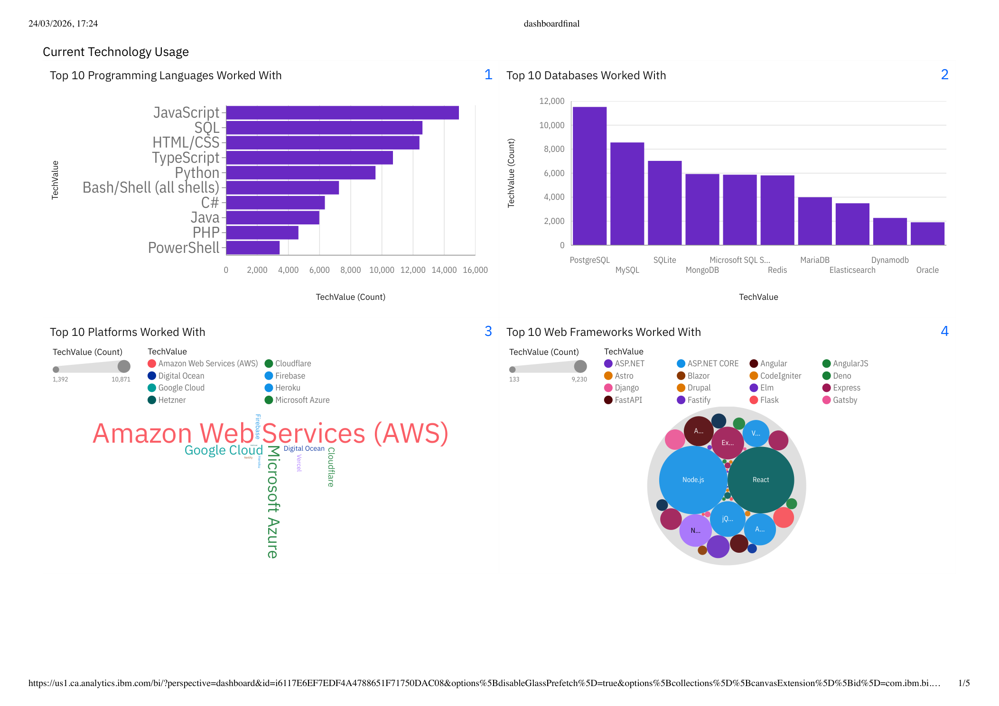

# Emerging Technology Trends Analysis

Emerging Technology Trends Analysis is a data analytics project focused on exploring current and future technology trends using developer survey-style data, Python analysis, and dashboard reporting.

The project is built as an end-to-end analytics case study with data preparation, trend exploration, dashboard creation, and visual storytelling around popular and emerging technologies.

## Live Demo

Not deployed. This project is presented through a Jupyter Notebook, dashboard PDF, dashboard screenshots, and a sample dashboard dataset.

## Preview

### Dashboard Screens

| Technology Overview | Programming Trends |
|---|---|
|  |  |

| Database Trends | Platform Insights |
|---|---|
|  |  |

| Final Dashboard View |
|---|
|  |

## Project Highlights

- Analyzes emerging technology trends from survey-style data.
- Explores popular programming languages, databases, platforms, and tools.
- Uses Python and Jupyter Notebook for data analysis.
- Includes a cleaned/sample dashboard dataset.
- Provides dashboard screenshots for quick visual understanding.
- Includes a final dashboard PDF report.
- Demonstrates data cleaning, transformation, and dashboard storytelling.
- Suitable for Data Analyst and Business Intelligence fresher portfolios.

## Tech Stack

- Python
- Pandas
- Jupyter Notebook
- Data Cleaning
- Data Transformation
- Dashboard Reporting
- Data Visualization
- CSV
- PDF Dashboard

## Dataset

The included dashboard-ready dataset is:

```text
final_dashboard_sample.csv
```

This sample dataset represents cleaned and transformed technology trend data prepared for dashboard creation and analysis.

## Main Files

```text
dashboard.ipynb                    Jupyter Notebook with analysis workflow
dashboardfinal.pdf                 Final dashboard/report export
final_dashboard_sample.csv         Cleaned/sample dashboard dataset
emerging_tech_dashboard_01.png     Dashboard screenshot
emerging_tech_dashboard_02.png     Dashboard screenshot
emerging_tech_dashboard_03.png     Dashboard screenshot
emerging_tech_dashboard_04.png     Dashboard screenshot
emerging_tech_dashboard_05.png     Dashboard screenshot
README.md                          Project documentation
```

## Analysis Approach

The project follows a standard data analytics workflow:

1. Load technology trend survey-style data
2. Review dataset structure and key columns
3. Clean and transform the data
4. Prepare dashboard-ready tables
5. Analyze technology popularity patterns
6. Explore programming language and database trends
7. Create dashboard visuals
8. Export final dashboard/report
9. Document insights for portfolio presentation

## Main Features

### Emerging Technology Trend Analysis

The project studies technology adoption patterns and identifies popular tools, platforms, databases, and programming languages.

### Dashboard-Ready Dataset

The repository includes `final_dashboard_sample.csv`, which can be used for dashboard creation and visual reporting.

### Visual Dashboard Reporting

The dashboard screenshots and PDF report make the analysis easy to review without running the notebook.

### Portfolio-Friendly Analytics Case Study

The project demonstrates practical data cleaning, analysis, visualization, and business-style reporting.

## Project Structure

```text
Emerging-Technology-Trends-Analysis/
├── README.md
├── dashboard.ipynb
├── dashboardfinal.pdf
├── final_dashboard_sample.csv
├── emerging_tech_dashboard_01.png
├── emerging_tech_dashboard_02.png
├── emerging_tech_dashboard_03.png
├── emerging_tech_dashboard_04.png
└── emerging_tech_dashboard_05.png
```

## Setup

Clone the repository:

```bash
git clone https://github.com/Sagnik0910/Emerging-Technology-Trends-Analysis.git
cd Emerging-Technology-Trends-Analysis
```

Install required Python libraries:

```bash
pip install pandas matplotlib seaborn jupyter
```

Open the notebook:

```bash
jupyter notebook dashboard.ipynb
```

## How To View The Dashboard

Open the final dashboard PDF:

```text
dashboardfinal.pdf
```

Or view the dashboard screenshots directly in the repository:

```text
emerging_tech_dashboard_01.png
emerging_tech_dashboard_02.png
emerging_tech_dashboard_03.png
emerging_tech_dashboard_04.png
emerging_tech_dashboard_05.png
```

## Example Use Cases

- Emerging technology trend analysis
- Developer survey data analysis
- Business intelligence dashboard practice
- Data analyst portfolio project
- Dashboard storytelling practice
- Python-based data cleaning and visualization
- Technology adoption reporting

## Current Limitations

- The project is not deployed as an interactive web dashboard.
- Dashboard interactivity is limited because the final output is exported as PDF/images.
- The repository uses a sample dashboard-ready dataset.
- More detailed insights can be added directly in the README.
- SQL-based analysis can be added in a future version.

## Future Improvements

- Add interactive dashboard using Power BI, Tableau, Streamlit, or Plotly Dash.
- Add SQL queries for technology trend analysis.
- Include more detailed business insights.
- Add year-wise trend comparison if more historical data is available.
- Add charts directly inside the README.
- Add an executive summary section.
- Deploy the dashboard publicly.

## Author

Sagnik Guha

GitHub: [Sagnik0910](https://github.com/Sagnik0910)
